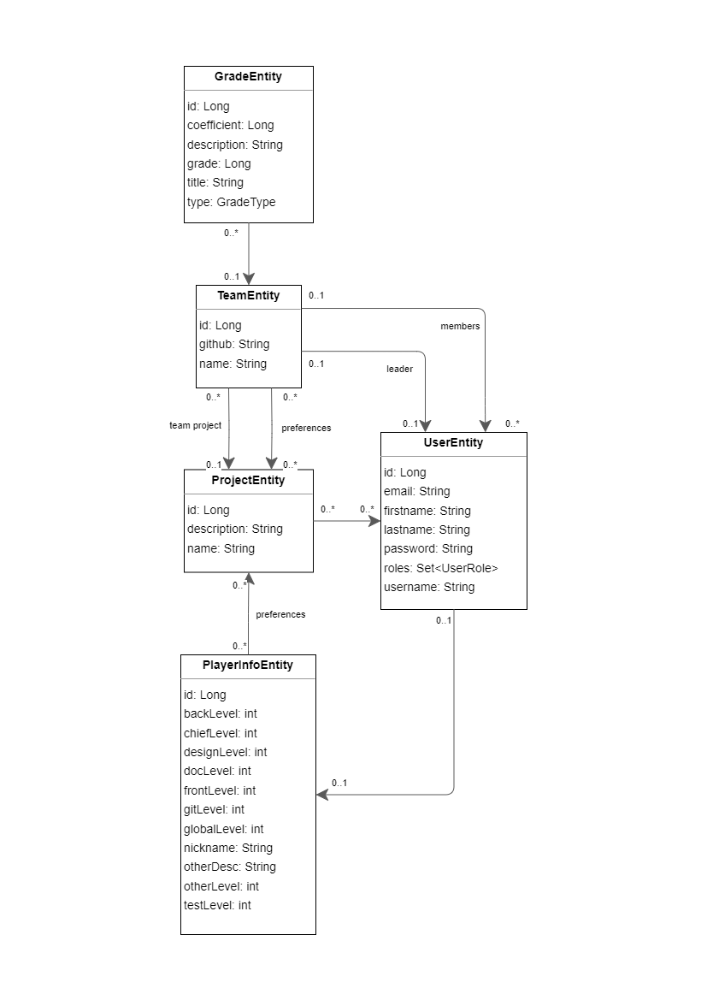

# Documentation technique

## Diagramme de classe

### Diagramme de classe définitif
Voici le diagramme de classe définitif de l'application :

- Version définitive grand format (PNG) : [sae-s5-final-diagram.drawio.png](./sae-s5-final-diagram.drawio.png)
- Version définitive éditable (JGraph / draw.io) : [sae-s5-final-diagram.drawio](./sae-s5-final-diagram.drawio)

### Diagramme de classe initial (= incomplet)

- Version initiale grand format (PNG) : [sae-s5-initial-diagram.drawio.png](./sae-s5-initial-diagram.drawio.png)
- Version initiale éditable (JGraph / draw.io) : [sae-s5-initial-diagram.drawio](./sae-s5-initial-diagram.drawio)

## Documentation technique Backend

### Installation

La documentation technique d'installation du backend est disponible [ici](../../sae-back/README.md).

## Documentation technique Frontend

### Installation

La documentation technique d'installation du frontend est disponible [ici](../../sae-front/README.md).
