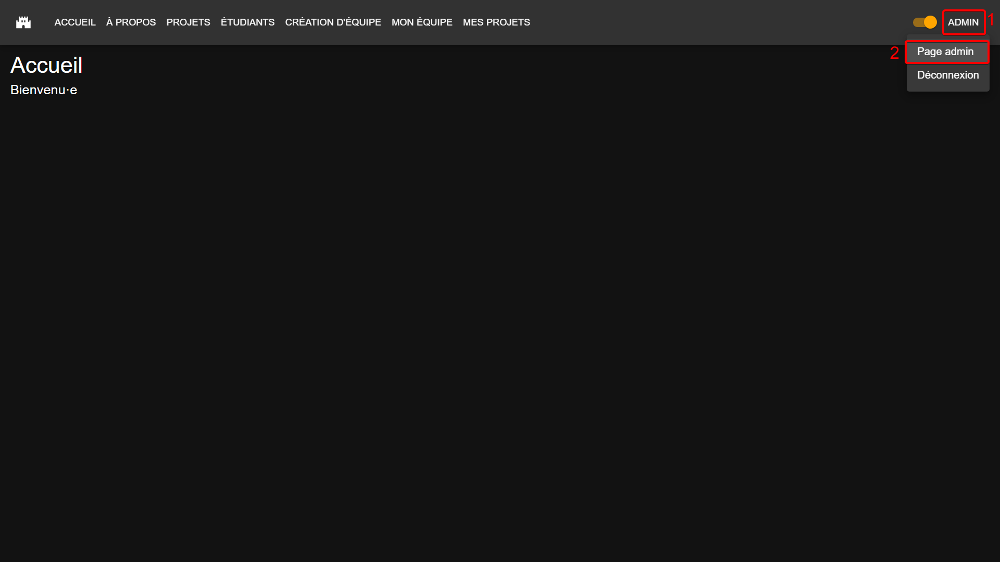
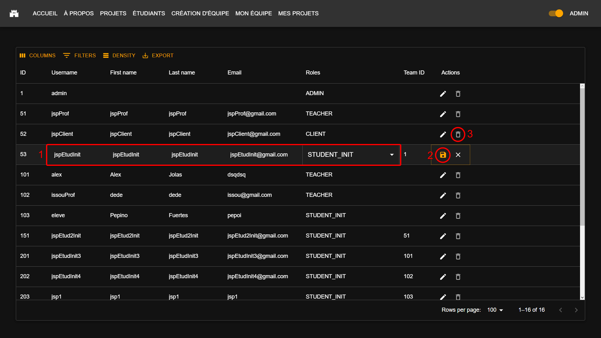

# Page d'administration

## Table des matières

- [Description](#description)
- [Fonctionnalités](#fonctionnalités)
  - [Affichage des utilisateurs](#affichage-des-utilisateurs)
  - [Modification d'un utilisateur](#modification-dun-utilisateur)
  - [Suppression d'un utilisateur](#suppression-dun-utilisateur)
- [Capture(s) d'écran](#captures-décran)

## Description

Cette page permet de gérer les utilisateurs de l'application.

| URL      | Rôle(s) requis | Condition(s) d'accès |
|----------|----------------|----------------------|
| /admin   | ADMIN          | Aucune               |

## Accéder à la page d'administration

Pour accéder à la page d'administration, il faut se connecter à l'application avec un compte ayant le rôle ADMIN. Ensuite, il faut cliquer sur le bouton de votre profil en haut à droite (numéro 1 sur l'image ci-dessous), puis cliquer sur le bouton "Page admin" (numéro 2 sur l'image ci-dessous).

## Fonctionnalités

### Affichage des utilisateurs

Cette page permet d'afficher la liste des utilisateurs de l'application. Pour chaque utilisateur, on peut voir ses informations.

### Modification d'un utilisateur

Lorsqu'on double-clique sur un utilisateur (ou qu'on clique sur le bouton en forme de crayon), la ligne du tableau passe en mode édition. Il est alors possible de modifier certains informations de l'utilisateur, à savoir :

- Username (nom d'utilisateur)
- First name (prénom)
- Last name (nom de famille)
- Email (adresse mail)
- Roles (rôles)

Voir numéro 1 sur l'image [ci-dessous](#captures-décran).

Une fois que nous avons terminé de modifier les informations, il faut cliquer sur le bouton en forme de disquette pour valider les modifications. Voir numéro 2 sur l'image [ci-dessous](#captures-décran).

### Suppression d'un utilisateur

Lorsqu'on clique sur le bouton en forme de poubelle, l'utilisateur est supprimé de l'application, après une validation par popup. Voir numéro 3 sur l'image [ci-dessous](#captures-décran).

## Capture(s) d'écran

