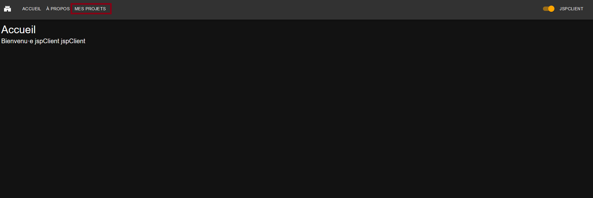
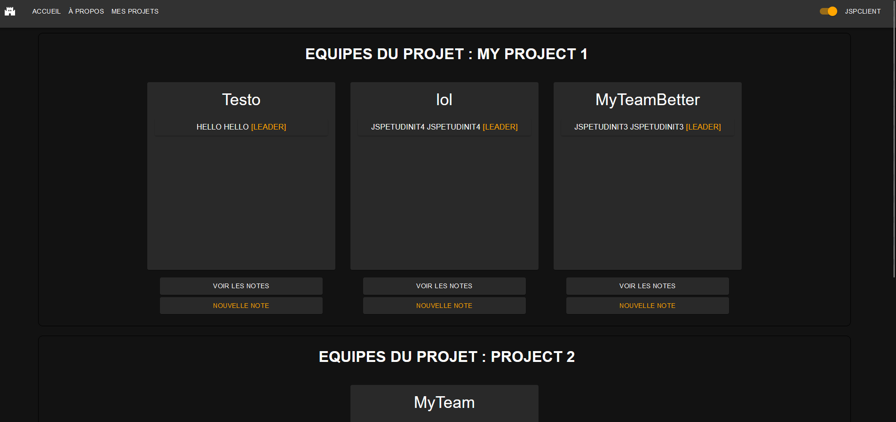
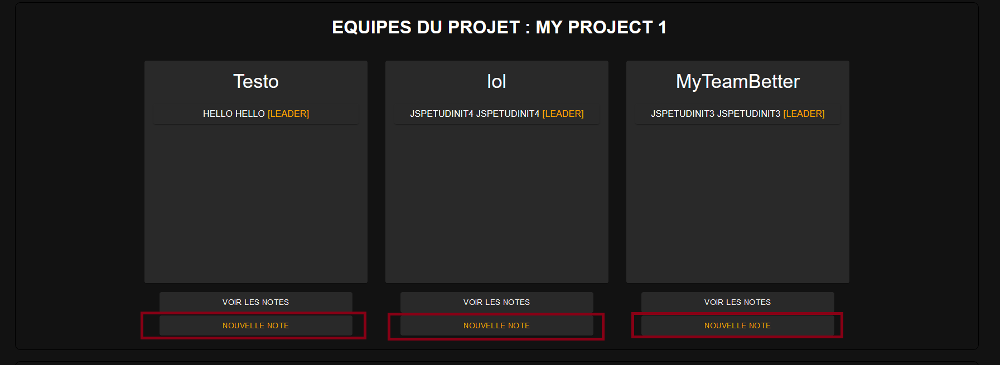
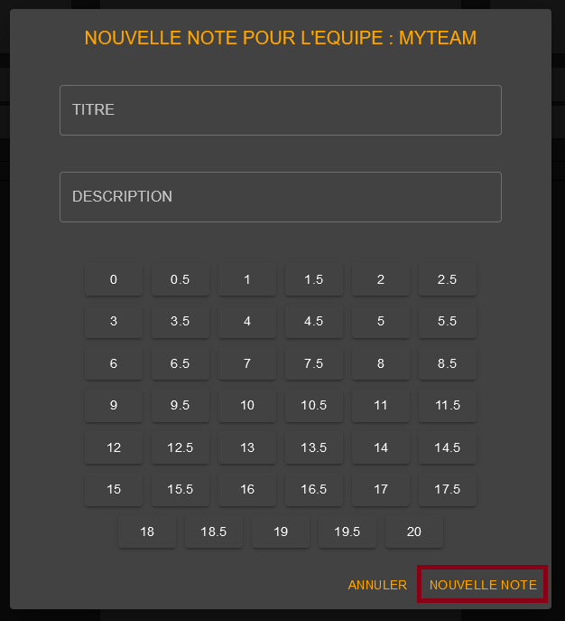
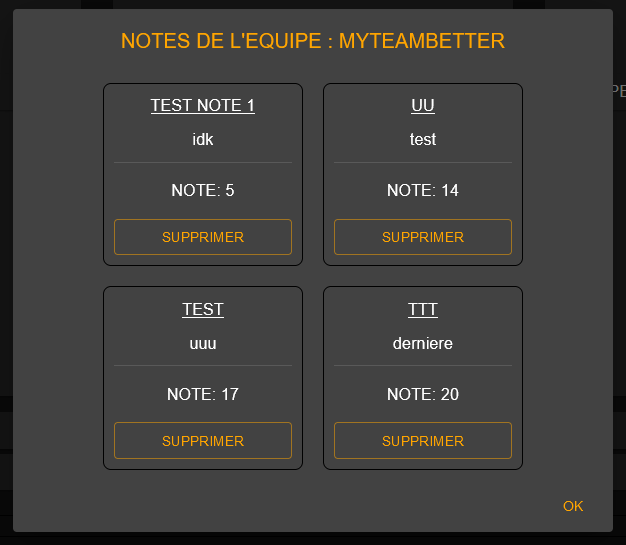
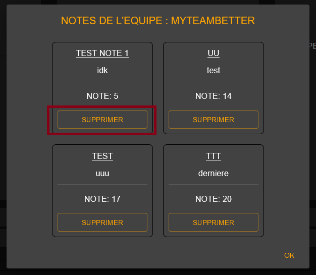

# Page de consultation des projets d'un client

## Table des matières

- [Description](#description)
- [Fonctionnalités](#fonctionnalités)
  - [Affichage des projets](#affichage-des-projets)
  - [Ajout d'une note](#ajout-dune-note)
  - [Affichage des notes](#affichage-des-notes)
  - [Suppression d'une note](#suppression-dune-note)

## Description

Cette page permet de gérer les utilisateurs de l'application.

| URL      | Rôle(s) requis | Condition(s) d'accès |
|----------|----------------|----------------------|
| /clients/projects  | CLIENT     | Aucune       |

## Accéder à la page de consultation des projets client

Pour accéder à la page de consultation des projets client, il faut se connecter à l'application avec un compte ayant le rôle CLIENT. Ensuite, il faut cliquer sur le bouton "Mes projets" dans la barre de navigation.

## Fonctionnalités

### Affichage des projets

Cette page permet d'afficher la liste des projets d'un client de l'application. Pour chaque projet, les différentes équipes affectées à ce projet sont affichées.

### Ajout  d'une note

Lorsqu'une équipe est affecté à un projet, on peut cliquer sur "nouvelle note" pour attribuer une nouvelle note à l'équipe.

Il est alors possible de renseigner plusieurs informations :

- Titre de la note
- Description de la note
- Note

Une fois les informations renseignées, on peut cliquer sur "nouvelle note" à nouveau pour ajouter la note.

### Affichage des notes

Lorsqu'une équipe est affecté à un projet, on peut cliquer sur "voir les notes" pour visualiser les notes de l'équipe.

Différentes informations sont affichées :
- Titre de la note
- Description de la note
- Note

Un bouton de suppression est également affiché.

### Suppression d'une note

En visualisant les notes, si une équipe possède une note, il est possible de supprimer cette note en cliquant sur le bouton "supprimer"

