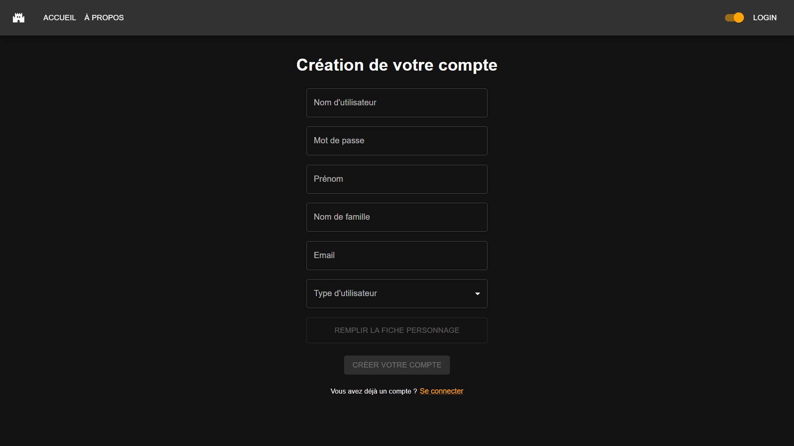
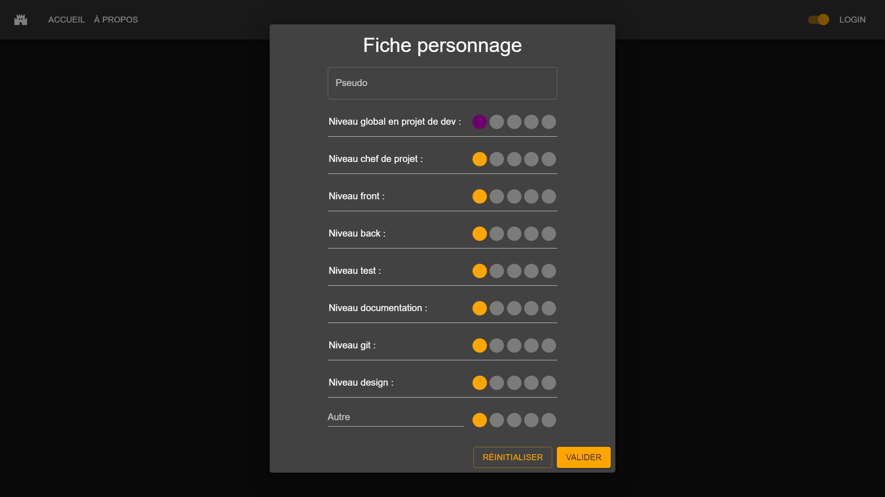

# Page d'inscription

## Table des matières

- [Description](#description)
- [Fonctionnalités](#fonctionnalités)
  - [Création de compte](#création-de-compte)
    - [Capture(s) d'écran](#captures-décran)
  - [Fiche personnage](#fiche-personnage)
    - [Capture(s) d'écran](#captures-décran-1)

## Description

Cette page permet de créer un compte pour pouvoir se connecter à l'application.

| URL                  | Rôle(s) requis | Condition(s) d'accès |
|----------------------|----------------|----------------------|
| /login/createAccount | Aucun          | Aucune               |

## Fonctionnalités

### Création de compte

Cette page comporte un formulaire permettant de créer un compte. Pour pouvoir créer un compte, il faut renseigner les champs suivants :

- Nom d'utilisateur
- Mot de passe
- Prénom
- Nom de famille
- Adresse mail
- Type d'utilisateur : étudiant initial, étudiant alternant, professeur ou client. <b>Dans le cas d'une inscription en tant que client / professeur, le rôle attribué sera en réalité un rôle "invité", qu'il faudra modifier par un administrateur.</b> (voir [ici](./docAdminPage.md#modification-dun-utilisateur))
- Fiche personnage : UNIQUEMENT pour les ÉTUDIANTS. Il s'agit d'une fiche permettant d'anonymiser les étudiants en leur permettant de renseigner leurs compétences. Cette fiche sera utilisée pour les recrutements dans des équipes. (Voir [Fiche personnage](#fiche-personnage))
  
#### Capture(s) d'écran

### Fiche personnage

La fiche personnage est un formulaire permettant de renseigner les compétences d'un étudiant. Elle permet de renseigner les champs suivants :

- Pseudo : nom d'utilisateur anonyme
- Niveau global en projet de développement : niveau global en développement de projet (note de 1 à 5)
- Niveau chef de projet : niveau en tant que chef de projet (note de 1 à 5)
- Niveau développeur : niveau en tant que développeur (note de 1 à 5)
- Niveau front : niveau en développement front (note de 1 à 5)
- Niveau back : niveau en développement back (note de 1 à 5)
- Niveau test : niveau en test (note de 1 à 5)
- Niveau documentation : niveau en documentation (note de 1 à 5)
- Niveau git : niveau en utilisation de git (note de 1 à 5)
- Niveau design : niveau en design (note de 1 à 5)
- Autre : champ libre permettant de renseigner un intitulé de compétence et un niveau associé (note de 1 à 5)

#### Capture(s) d'écran

