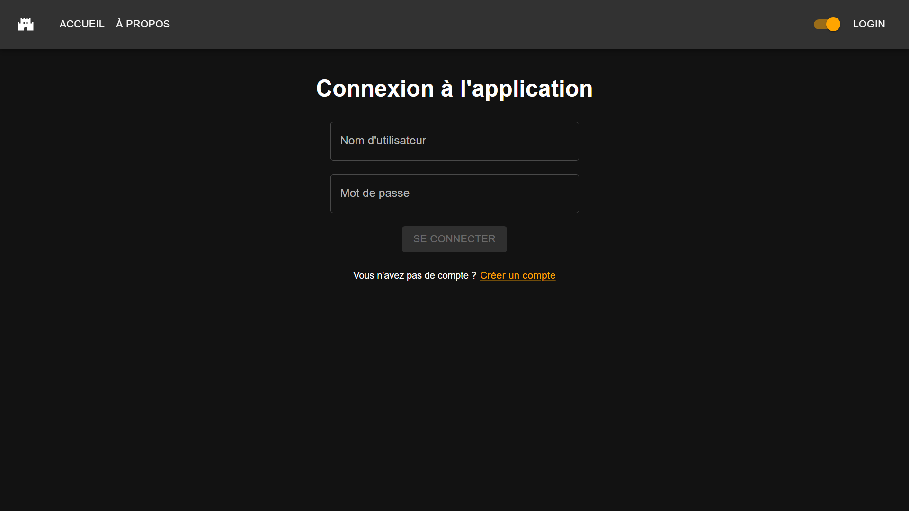

# Page de connexion

## Table des matières

- [Description](#description)
- [Fonctionnalités](#fonctionnalités)
  - [Connexion](#connexion)
    - [Capture(s) d'écran](#captures-décran)

## Description

Cette page permet de se connecter à l'application.

| URL    | Rôle(s) requis | Condition(s) d'accès |
|--------|----------------|----------------------|
| /login | Aucun          | Aucune               |

## Fonctionnalités

### Connexion

Cette page comporte un formulaire permettant de se connecter à l'application. Pour pouvoir se connecter, il faut renseigner un nom d'utilisateur et un mot de passe, en partant du principe que l'utilisateur est déjà inscrit dans l'application.

#### Capture(s) d'écran

### Création de compte

Il est possible de créer un compte en cliquant sur le bouton "Créer un compte". Cela redirige vers la page d'inscription.