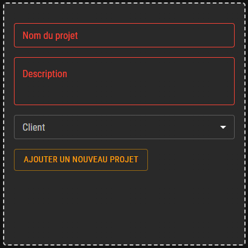
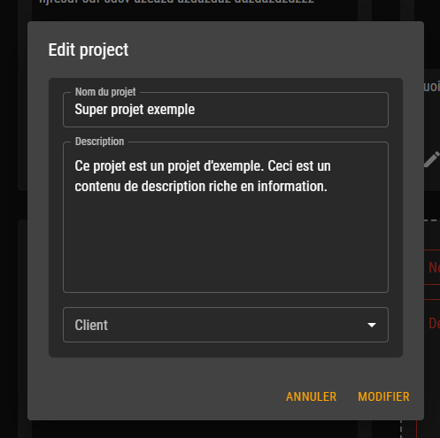

# TEMPLATE

## Table des matières

- [Description](#description)
- [Fonctionnalités](#fonctionnalités)
    - [Création d'un projet](#création-dun-projet)
    - [Modification d'un projet](#modification-dun-projet)
    - [Suppression d'un projet](#suppression-dun-projet)

## Description

Cette page permet de gérer les projets.

| URL       | Rôle(s) requis | Condition(s) d'accès |
|-----------|----------------|----------------------|
| /projects | ADMIN, TEACHER | Acune                |

## Fonctionnalités

### Création d'un projet

Pour accéder à la page de création d'un projet, il faut se connecter à l'application avec un compte ayant le rôle ADMIN ou TEACHER.
Ensuite, il faut cliquer "Projets" dans la barre de navigation. Depuis cette page, il est possible de remplir le formulaire de création d'un projet.

Ce formulaire est composé de trois champs :
- Le nom du projet (minimum 2 caractères)
- La description du projet (minimum 5 caractères)
- La liste des clients (minimum 1 client)

La liste des clients selectionnable correspond à la liste des comptes avec le rôle "CLIENT".
Une fois les champs remplis, il suffit de cliquer sur le bouton "Ajouter un nouveau projet" pour créer le projet.

### Modification d'un projet

Le bouton de modification d'un projet correspond à l'icone de crayon.
Cliquer sur ce bouton permet d'ouvrir le formulaire de modification d'un projet.

Ce formulaire permet de modifier les trois champs composant un projet en respectant les mêmes contraintes que pour la création d'un projet.
Une fois les modifications effectuées, il suffit de cliquer sur le bouton "Modifier" pour enregistrer les modifications. Dans le cas contraire, il suffit de cliquer sur le bouton "Annuler".

### Suppression d'un projet

Le bouton de suppression d'un projet correspond à l'icone de poubelle.
Cliquer sur ce bouton permet de supprimer le projet.
