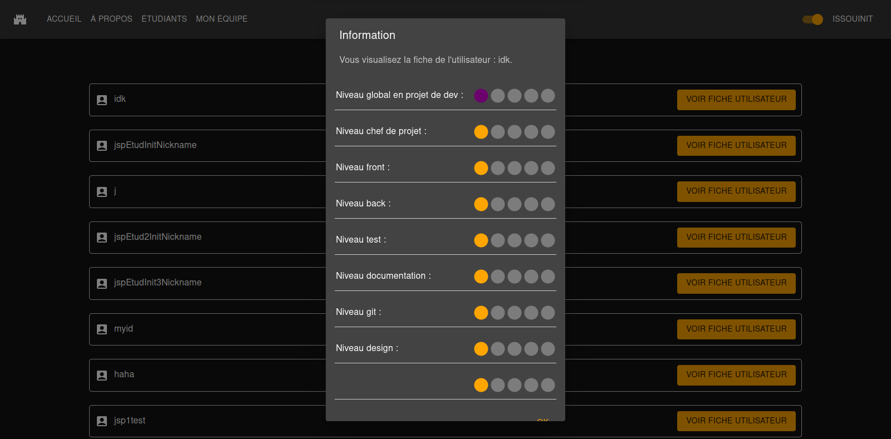

# Page d'informations des étudiants à inviter au sein de son projet

## Table des matières

- [Page d'informations des étudiants à inviter au sein de son projet](#page-dinformations-des-étudiants-à-inviter-au-sein-de-son-projet)
  - [Table des matières](#table-des-matières)
  - [Description](#description)
  - [Accéder à la page de visualisation des informations des élèves (initiaux et alternants) sans équipes](#accéder-à-la-page-de-visualisation-des-informations-des-élèves-initiaux-et-alternants-sans-équipes)
  - [Fonctionnalités](#fonctionnalités)
    - [Visualisation de tous les élèves sans équipes](#visualisation-de-tous-les-élèves-sans-équipes)
      - [Capture(s) d'écran](#captures-décran)
    - [Inivtation d'un élève dans notre projet](#inivtation-dun-élève-dans-notre-projet)
      - [Capture(s) d'écran](#captures-décran-1)
    - [Inivtation envoyée](#inivtation-envoyée)
      - [Capture(s) d'écran](#captures-décran-2)
    - [Visualisation des fiches joueurs](#visualisation-des-fiches-joueurs)
      - [Capture(s) d'écran](#captures-décran-3)
    - [Rafraîchissement de la page](#rafraîchissement-de-la-page)
      - [Capture(s) d'écran](#captures-décran-4)

## Description

Cette page permet de se connecter à l'application.

| URL    | Rôle(s) requis | Condition(s) d'accès |
|--------|----------------|----------------------|
| /student | STUDENT_INIT | Être le leader       |

## Accéder à la page de visualisation des informations des élèves (initiaux et alternants) sans équipes 

On accède à la page en appuyant sur le bouton "ÉTUDIANTS" qui se situe dans la navbar de la page lorsqu'on est connecté en tant qu'élève initial et leader.

## Fonctionnalités

### Visualisation de tous les élèves sans équipes

Lorsque l'utilisateur arrive sur la page, il est au courant de savoir quel élève n'a pas d'équipes. Un rectangle bleu apparaît pour informer l'utilisateur de combien d'élèves n'ont pas d'équipes. De plus, les élèves qui n'ont pas d'équipes apparaîtront en tête de liste comme le montre l'image ci-dessous.

#### Capture(s) d'écran

### Inivtation d'un élève dans notre projet

Il est possible pour l'utilisateur d'inviter des élèves dans sont projet en cliquant sur le bouton violet "INVITER UTILISATEUR", puis en confirmant l'invitation.

#### Capture(s) d'écran

### Inivtation envoyée

L'invitation sera alors envoyée et le bouton "INVITER UTILISATEUR" disparaîtra de l'interface.

#### Capture(s) d'écran

### Visualisation des fiches joueurs

L'utilisateur pourra consulter les fiches de chaque joueur, ce qui lui permettra de faire le choix selon ses besoins, cette fiche recense les skills relatifs à chaque joueur. 

#### Capture(s) d'écran

### Rafraîchissement de la page

Lorsque tout les élèves ne sont plus disponibles car ils sont déjà affectés à un projet, ou en attente de validation de l'invitation d'un projet, ce petit message apparaîtra.

#### Capture(s) d'écran

