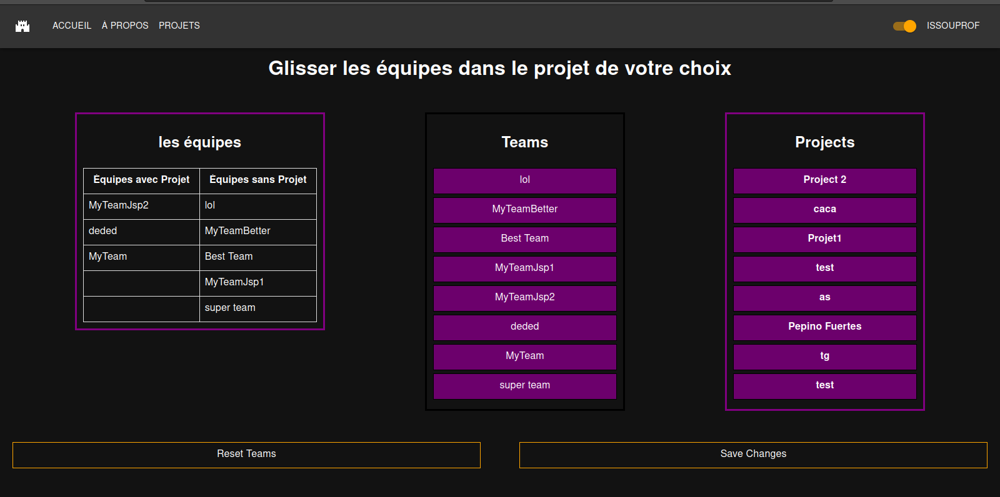
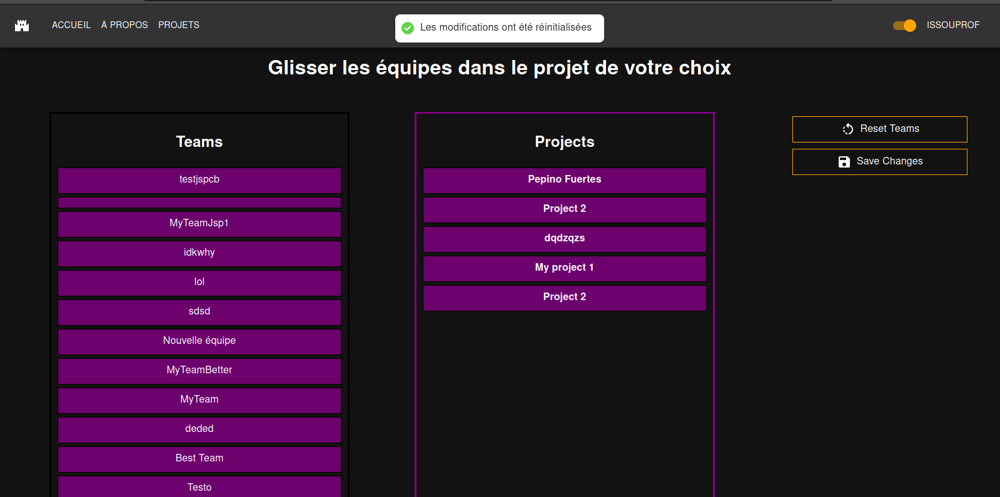
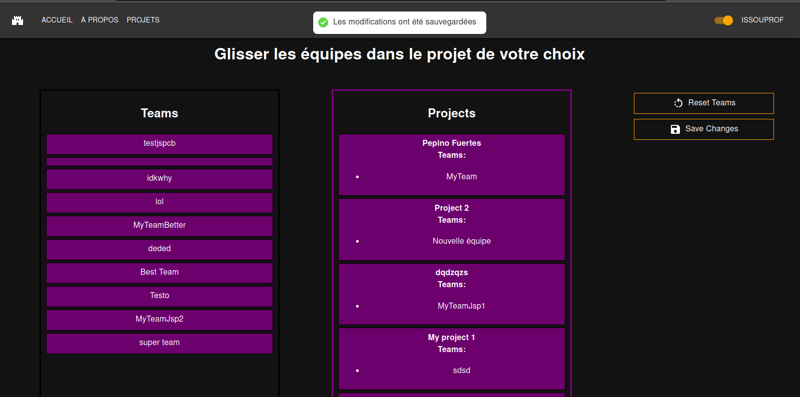

# Page d'affectation des équipes aux projets

## Table des matières

- [Page d'affectation des équipes aux projets](#page-daffectation-des-équipes-aux-projets)
  - [Table des matières](#table-des-matières)
  - [Description](#description)
  - [Accéder à la page d'affectation des sujets](#accéder-à-la-page-daffectation-des-sujets)
  - [Fonctionnalités](#fonctionnalités)
    - [L'affectation (Drag and drop)](#laffectation-drag-and-drop)
      - [Capture(s) d'écran](#captures-décran)
    - [le Reset](#le-reset)
      - [Capture(s) d'écran](#captures-décran-1)
    - [La sauvegarde](#la-sauvegarde)
      - [Capture(s) d'écran](#captures-décran-2)

## Description

Cette page permet de se connecter à l'application.

| URL    | Rôle(s) requis | Condition(s) d'accès |
|--------|----------------|----------------------|
| /subject | PROF         | Être professeur      |

## Accéder à la page d'affectation des sujets 

On accède à la page en appuyant sur le bouton "Affectation des équipes aux projet" qui se situe en bas de la page "/projects"

## Fonctionnalités

Système de glisser déposer (Drag and drop)

### L'affectation (Drag and drop)

Comme l'indique le texte en blanc, l'utilisateur aura la possibilité de glisser et déposer une équipe au sein d'un projet à la fois, celle-ci s'affichera sous la forme de bullet point au niveau du projet.  

#### Capture(s) d'écran

### le Reset

Le reset permettra aux utilisateurs de retirer toutes les équipes présentes sur un projet, utile lors des fin d'années. 

#### Capture(s) d'écran

### La sauvegarde

Enfin, l'utilisateur sera en capacité de sauvegarder ses changements avec le bouton "Save changes" qui permettra d'enregistrer les modifications apportées au préalable.

#### Capture(s) d'écran

