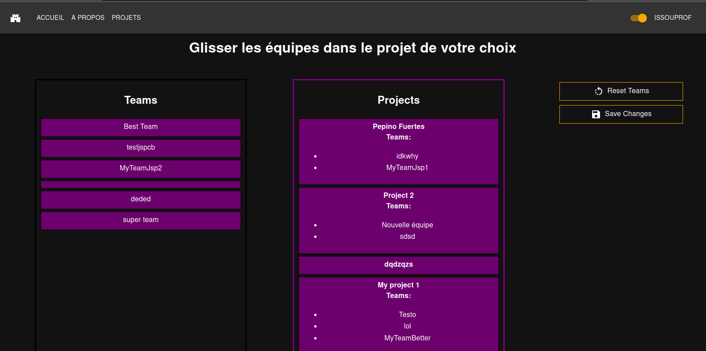

# Page d'affectation des équipes aux projets

## Table des matières

- [Page d'affectation des équipes aux projets](#page-daffectation-des-équipes-aux-projets)
  - [Table des matières](#table-des-matières)
  - [Description](#description)
  - [Accéder à la page d'affectation des sujets](#accéder-à-la-page-daffectation-des-sujets)
  - [Fonctionnalités](#fonctionnalités)
    - [Visualisez les projets sans équipes](#visualisez-les-projets-sans-équipes)
      - [Capture(s) d'écran](#captures-décran)
    - [Prise en compte du cas d'erreur](#prise-en-compte-du-cas-derreur)
      - [Capture(s) d'écran](#captures-décran-1)
    - [le Reset](#le-reset)
      - [Capture(s) d'écran](#captures-décran-2)
    - [L'affectation (Drag and drop)](#laffectation-drag-and-drop)
      - [Capture(s) d'écran](#captures-décran-3)
    - [La sauvegarde](#la-sauvegarde)
      - [Capture(s) d'écran](#captures-décran-4)

## Description

Cette page permet de se connecter à l'application.

| URL    | Rôle(s) requis | Condition(s) d'accès |
|--------|----------------|----------------------|
| /subject | PROF         | Être professeur      |

## Accéder à la page d'affectation des sujets 

<Ajout à la main>

## Fonctionnalités

Système de glisser déposer (Drag and drop)

### Visualisez les projets sans équipes

Cette page comporte un tableau sur la partie gauche de l'écran qui nous permet de visualiser rapidement les projets qui n'ont pas d'équipes ainsi que les équipes qui n'ont pas de projets.

#### Capture(s) d'écran

### Prise en compte du cas d'erreur

Si l'utilisateur essaie d'ajouter une équipe alors quelle à déjà un projet alors ceci s'affichera :

#### Capture(s) d'écran

### le Reset

Le reset permettra aux utilisateurs de retirer toutes les équipes présentes sur un projet, utile lors des fin d'années. 

#### Capture(s) d'écran

### L'affectation (Drag and drop)

Comme l'indique le texte en blanc, l'utilisateur aura la possibilité de glisser et déposer une équipe au sein d'un projet à la fois, celle-ci s'affichera sous la forme de bullet point au niveau du projet.  

#### Capture(s) d'écran

### La sauvegarde

Enfin, l'utilisateur sera en capacité de sauvegarder ses changements avec le bouton "Save changes" qui permettra d'enregistrer les modifications apportées au préalable.

#### Capture(s) d'écran

