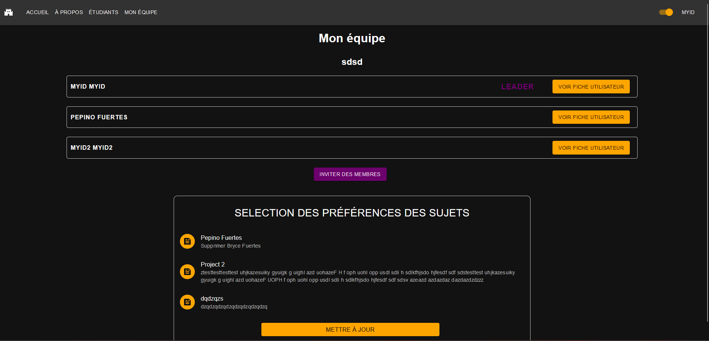
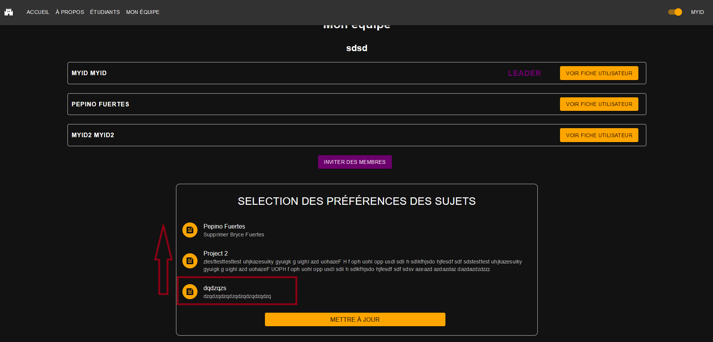

# Page des informations de l'équipe

## Table des matières

- [Description](#description)
- [Fonctionnalités](#fonctionnalités)
  - [Affichage des informations](#affichage-des-informations)
  - [(LEADER) Inviter des membres](#inviter-des-membres)
  - [(LEADER) Choisir les préférences de sujet](#choisir-les-préférences-de-projet)

## Description

Cette page permet d'accéder aux informations de son équipe.

| URL      | Rôle(s) requis | Condition(s) d'accès |
|----------|----------------|----------------------|
| /teams/infos  | STUDENT_INIT / STUDENT_ALT    | Appartenir à une équipe   |

## Accéder à la page de consultation des informations de son équipe

Pour accéder à la page de consultation des informations de son équipe, il faut se connecter à l'application avec un compte ayant le rôle STUDENT_INIT ou STUDENT_ALT. Ensuite, il faut avoir une équipe et cliquer sur le bouton "Mon équipe" dans la barre de navigation.

## Fonctionnalités

### Affichage des informations

Cette page permet d'afficher la liste des informations de son équipe. On y retrouve le nom, ainsi que tout les étudiants dans l'équipe.

Concernant le leader de la team (celui qui l'a créée), il a accès à deux autres fonctionnalités :
- Inviter des membres
- Selectionner des préférences pour le choix du projet de son équipe

### Inviter des membres

Si l'utilisateur est le leader de la team, il peut inviter de nouvelles personnes à rejoindre son équipe. Pour cela il peut cliquer sur le bouton "Inviter des membres", ce qui va le rediriger vers une autre page /students dans laquelle il pourra inviter de nouvelles personnes.

### Choisir les préférences de projet

Si l'utilisateur est le leader de l'équipe, il peut choisir choisir les projets dans lesquels lui et son équipe aimerait être affecté. 

Cette préférence se fait sous forme de liste. Pour classer les projets, il suffit de maintenir le click sur un projet et de le glisser dans la liste, en sachant que le porjet en haut de la liste correspond au projet le plus aimé, tandis que le projet en bas de la liste correspond au projet le moins aimé par l'équipe.

